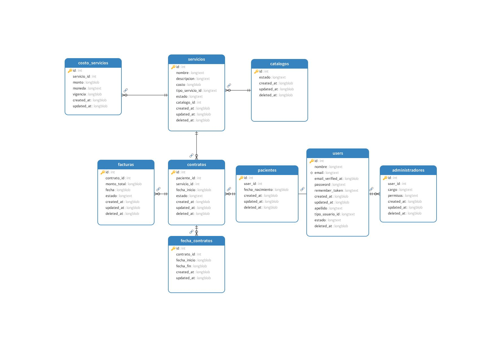

# Microservicio Comercial - Nur-tricenter

## Descripción

El Microservicio Comercial es un componente central del sistema Nur-tricenter que gestiona todos los aspectos comerciales y contractuales de los servicios nutricionales. Este microservicio es responsable de la gestión del catálogo de servicios, la administración de contratos y la facturación de los servicios ofrecidos por la empresa.

## Propósito

El propósito principal es proporcionar una plataforma robusta y escalable que permita:
- Gestionar el catálogo de servicios nutricionales
- Administrar los contratos de los pacientes
- Manejar el proceso de facturación
- Proporcionar una API para la integración con otros microservicios

## Funcionalidades

### 1. Gestión de Catálogo
- Definición y mantenimiento del catálogo de servicios
- Administración de precios y costos de servicios
- Actualización de estados de servicios
- Consulta de servicios disponibles

### 2. Gestión de Contratos
- Creación de contratos para servicios nutricionales
- Activación y cancelación de contratos
- Seguimiento del estado de contratos
- Consulta de historial de contratos por paciente

### 3. Facturación
- Generación automática de facturas
- Emisión de facturas por servicios contratados
- Gestión del estado de facturas
- Consulta de historial de facturación

### 4. Administración de Usuarios
- Gestión de perfiles de usuarios (Administradores y Pacientes)
- Validación de credenciales
- Actualización de información de usuarios
- Control de permisos y accesos

## Diagrama de Clases del Dominio

  

## Base de Datos

  

El diagrama muestra la estructura central del dominio, incluyendo:
- Agregados principales (Usuario, Catálogo, Contrato)
- Entidades (Administrador, Paciente, Factura)
- Objetos de valor (Email, CostoServicio, FechaContrato)
- Relaciones y comportamientos clave del dominio

## Tecnologías Utilizadas
- Laravel 11
- PHP 8.2+
- MySQL/PostgreSQL
- Laravel Modules
